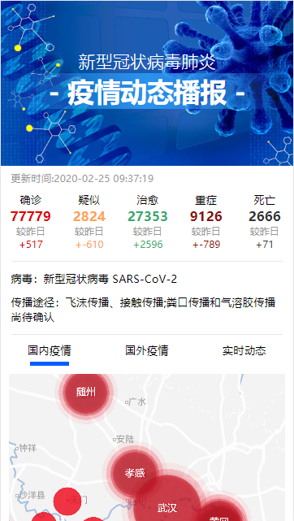

# 疫情动态 `全民战疫情，贡献一份力量。`

### 技术栈
1、react

2、redux

3、echarts

4、node.js

### 使用方法
1、安装依赖
```
# 前端项目安装依赖
cd web
npm install

# node.js项目安装依赖
cd server
npm install
```
2、前端项目里，依赖安装完毕后，如果要兼容IE浏览器看这部，不需要兼容则直接进行第3步
```javascript
//1、进入项目node_modules\react-scripts\config\webpack.config.js文件夹配置webpack.config.js
//2、找到 entry 值，将内部的两个参数位置调换一下位置（把 paths.appIndexJs 放到最上面）

//修改的位置展示
entry: [
	// Include an alternative client for WebpackDevServer. A client's job is to
    // connect to WebpackDevServer by a socket and get notified about changes.
    // When you save a file, the client will either apply hot updates (in case
    // of CSS changes), or refresh the page (in case of JS changes). When you
    // make a syntax error, this client will display a syntax error overlay.
    // Note: instead of the default WebpackDevServer client, we use a custom one
    // to bring better experience for Create React App users. You can replace
    // the line below with these two lines if you prefer the stock client:
    // require.resolve('webpack-dev-server/client') + '?/',
    // require.resolve('webpack/hot/dev-server'),
    paths.appIndexJs,//新位置
    isEnvDevelopment &&
            require.resolve('react-dev-utils/webpackHotDevClient'),
    // Finally, this is your app's code:
    //paths.appIndexJs,旧位置
    // We include the app code last so that if there is a runtime error during
    // initialization, it doesn't blow up the WebpackDevServer client, and
    // changing JS code would still trigger a refresh.
].filter(Boolean),

```
3、启动项目
```
# 前端项目启动项目
cd web
npm start

# node.js项目启动项目
cd server
node index.js
```
4、前端项目打包
```
cd web
npm run build
```
### 前端文件目录结构
```
├── build
├── node-modules
├── public
├── src
│   ├── images
│   ├── components
│   	├── mapStyle.json			//地图组件内地图样式数据
│   	├── mapView.js				//地图组件
│   	├── yqList.css				//疫情列表组件
│   	├── yqList.js				//疫情列表组件样式
│   	├── tuBiao.js				//图表组件1
│   	├── tuBiao2.js				//图表组件2
│   ├── pages
│   	├── GuoNeiYiQing.js		//国内疫情页面
│   	├── GuoWaiYiQing.js		//国外疫情页面
│   	├── index.css			//首页样式
│   	├── index.js			//首页
│   	├── shishidongtai.css	//实时动态样式
│   	├── ShiShiDongTai.js	//实时动态页面
│   ├── request
│   	├── index.js			//axios配置文件
│   ├── store
│   	├── index.js			//redux仓库配置文件
│   	├── reducer.js			//redux状态管理模块
│   ├── index.js				//项目入口文件
│   ├── public.css				//项目全局样式
├── .gitignore					//git忽略文件配置文件
├── package.json				//项目模块描述文件（项目配置文件）
├── package-lock.json			//项目模块记录文件
```

